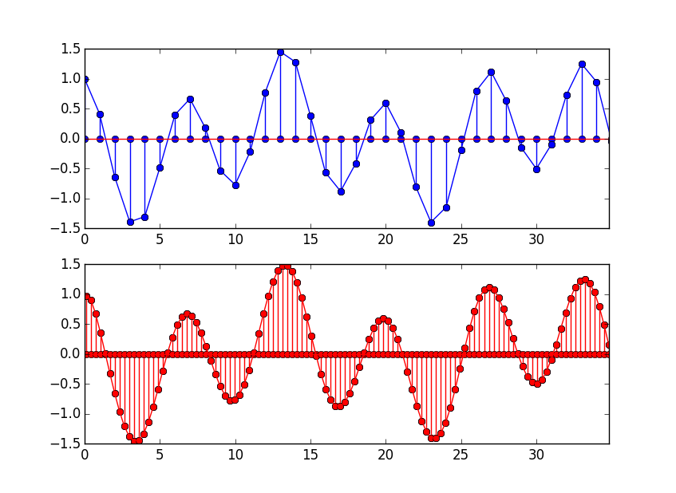

[](https://travis-ci.org/JayKickliter/Multirate.jl)
[](https://coveralls.io/r/JayKickliter/Multirate.jl)



`Multirate` is a package for the creation and execution of streaming (stateful) FIR filters which can also perform sample rate conversion.


# Installation

```julia
Pkg.add( "Multirate" )
```

`Multirate` depends on [`DSP`](https://github.com/JuliaDSP/DSP.jl) for [windowing](http://en.wikipedia.org/wiki/Window_function) functions.

# Usage

## Direct Filtering ##

These methods allow one-time filter of a vector without the creating of a filter object.

In these examples, `x` and `h` are previously defined signal & filter-taps vectors.

```julia
using Multirate

# decimate by 3
y = filt( h, x, 1//3 )

# interpolate by 3 
y = filt( h, x, 3//3 )

# resample with a ratio of 3/4
# equivalent to interpolating by 3, then decimating by 4
# ( but much more efficient )
y = filt( h, x, 3//4 )
```

## Streaming ##

To use `Multirate`'s streaming filter functionality, you must first create a filter object. Every time you call `filt` with that object, the filtering processes picks up where it left off. This is good for processing large vectors from a file, or filtering a stream of samples of indefinite length.

Each filter object is of type `FIRFilter{Tk<:FIRKernel}`. There are four subtypes of `FIRKernel`:

* `FIRStandard`: normal single-rate FIR filter
* `FIRInterpolator`: resampling with a ratio of `L//1`
* `FIRDecimator`: resampling with a ratio of `1//M`
* `FIRRational`: resampling with a ratio of `L/M`

You do not need to specify the kernel type. It is chosen for you when you based on the resampling ratio you specify when creating a new `FIRFilter` object.

One thing to note is that for decimation and rational resampling, there are instances where `filt` will return an empty vector. This is because those filters require a certain number of inputs to compute an output. If you  call `filt` and it returns an empty vector, it is working normally, and will eventually return processed samples when it receives enough inputs. However, your code should be written in a way that does not assume that the returned vectors are not empty.

In the following example, we will be resampling with a ratio of `3//17`. Please note that the filter taps `h` in this example is contrived to show you the input to output progression. It performs no useful signal filtering.

```jlcon
julia> x = [ 1.0:100 ]
100-element Array{Float64,1}:
   1.0
   2.0
   3.0
   4.0
   5.0
   6.0
   ⋮
  95.0
  96.0
  97.0
  98.0
  99.0
 100.0


julia> h = [ ones(3), zeros(6) ]
9-element Array{Float64,1}:
 1.0
 1.0
 1.0
 0.0
 0.0
 0.0
 0.0
 0.0
 0.0

julia> myfilt = FIRFilter( h, 3//17 )
FIRFilter{FIRRational}(FIRRational(3x3 Array{Float64,2}:
 0.0  0.0  0.0
 0.0  0.0  0.0
 1.0  1.0  1.0,3//17,3,3,0,1,1),[0.0,0.0],2)

julia> y1 = filt( myfilt, x[1:5] )
1-element Array{Float64,1}:
 1.0

julia> y2 = filt( myfilt, x[6:23] )
4-element Array{Float64,1}:
  6.0
 12.0
 18.0
 23.0

julia> y3 = filt( myfilt, x[24:100] )
13-element Array{Float64,1}:
 29.0
 35.0
 40.0
 46.0
 52.0
 57.0
 63.0
 69.0
 74.0
 80.0
 86.0
 91.0
 97.0

julia> y = [ y1, y2, y3 ]
18-element Array{Float64,1}:
  1.0
  6.0
 12.0
 18.0
 23.0
 29.0
  ⋮
 69.0
 74.0
 80.0
 86.0
 91.0
 97.0
```

Let's check that `y`, created by filtering three separate chunks of `x`, matches the result we would obtain from stateless filtering.

```jlcon
julia> sum( y .- filt( h, x, 3//17 ) )
0.0
```

# Speed

The naive approach to resampling is a two to three step process, depending on whether you are decimating, interpolating, or both in case of rational resampling. For a rational factor, the processes look like:

1. Stuff `L-1` zeros between each input sample.
2. Apply your anti-alias filter. This fills in those zeros from step 1.
3. Keep one out of `M` samples from step 2, and throw away the rest.

Let's design a naive rational resampler:

```julia
function naiveresampler{T}( h::Vector{T}, x::Vector{T}, ratio::Rational{Int} )
    upfactor   = num( ratio )
    downfactor = den( ratio )
    xStuffed   = zeros( T, length(x) * upfactor )

    for n in 0:length(x)-1
        xStuffed[ n*upfactor+1 ] = x[ n+1 ]
    end

    yInterpolated = DSP.firfilt( h, xStuffed )
    y = [ yInterpolated[n] for n = 1:downfactor:length( yInterpolated ) ]
end
```

and define some input samples:

```julia
# resample from 48 kHz to 44.1 kHz
sampleRate    = 48000
interpolation = 147
decimation    = 160
ratio         = interpolation//decimation
numTaps       = 24*interpolation           # that's a lot of taps
x             = rand( Float32, 1_000_000 )
h             = Multirate.firdes( numTaps, 0.5/interpolation, Multirate.kaiser, beta = 7.8562  )
```

Now let's time `naiveresampler` and `Multirate.filt`:

```jlcon
julia> @time y = naiveresampler( h, x, 147//160 );
elapsed time: **3.713267311 seconds** (**2361632424** bytes allocated, 5.05% gc time)
```

```jlcon
julia> resampler = Multirate.FIRFilter( h, ratio );

julia> @time y = Multirate.filt( resampler, x );
elapsed time: **0.056938961 seconds** (**7350144** bytes allocated)
```

The difference in speed is huge, but not necessarily surprising. Perhaps the most surprising part of this demo is the memory allocation. `naiveresampler` allocated almost 2.4 GB vs `Multirate.filt`'s 7.4 MB.

`Multirate` is not heavily optimized numerically speaking, and has much room for improvement, but by using polyphase FIR implementation it is able to only do math on the samples that are kept. It doesn't waste cycles multiplying taps by stuffed zeros, and it does not do any multiplications on samples that are thrown out in the decimation process. Despite this, it produces results identical to the naive approach.

One way the code is optimized is that the filter-taps/polyphase-filter-banks are flipped in memory. Many filter routines found on the internet use the literal definition of discrete convolution by moving forward in memory through the input samples, and backwards in memory through the filter taps, or vice versa. Having the coefficients flipped is more friendly to the compiler. In some cases the compiler will emit [SIMD](http://en.wikipedia.org/wiki/SIMD) instructions to perform multiple multiplications at a time.
